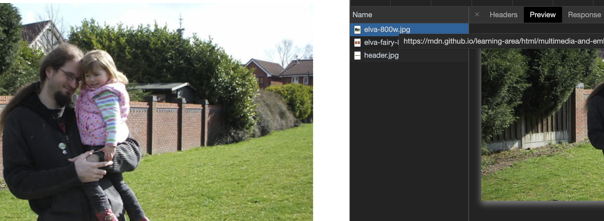
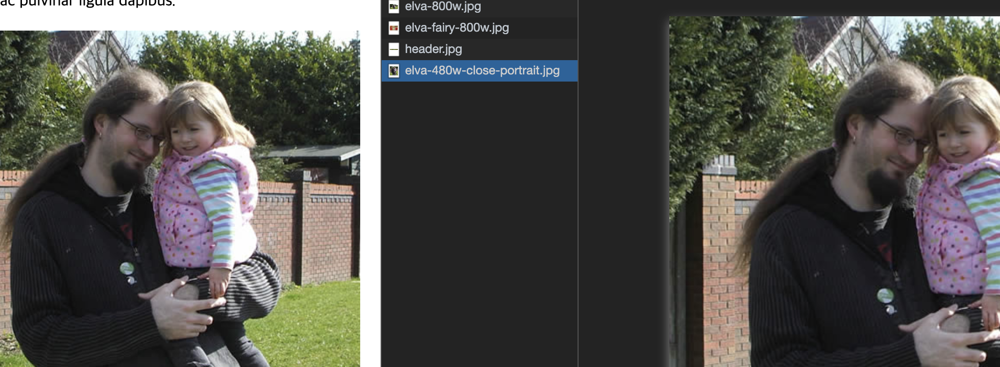
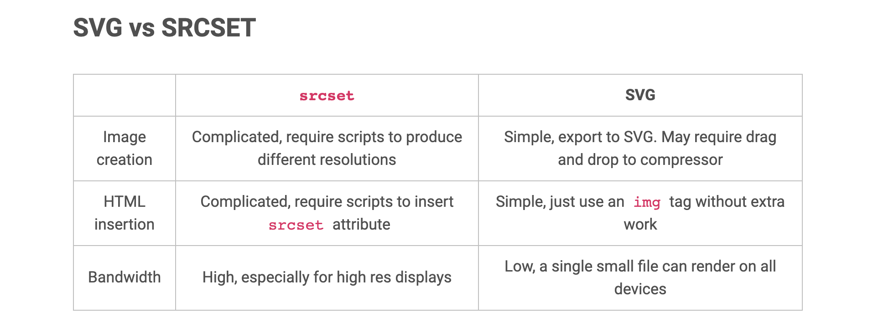

# 반응형 이미지와 HTTP 요청

`srcset` 을 사용했을때 HTTP 요청은 어떻게 이뤄질까? 라는 질문에서 시작된 글이다.

## srcset

.png)
caniuse (support srcset attribute)  

### Resolution

동일한 사이즈로 다양한 해상도 지원이 가능하게 사용할 수 있으며 두번재 인자 값으로 (ratio)x 작성 할 수 있다.
```html

```


### Responsive

또는 `size` 속성을 사용하여 breakpoint 에 따라 최적화된 이미지를 사용할 수 있다.

`size` 의 조건은 참이 실행되면 이하 조건을 무시하고 마지막에 조건이 없는 경우는 모든 조건이 참이 아닐 경우 실행된다.
```html

```

### Art direction

아트 디렉션 문제(이미지의 서로 다른 해상도로 인해 의도와 다른 연출이 될때)는 서로 다른 환경의 디스플레이에서 의도한 연출 방향의 이미지로 변경할 수도 있다.
```html
<picture>
  <source media="(max-width: 959px)" srcset="image-960w-portrait.jpg">
  <source media="(min-width: 960px)" srcset="image-960w-landscape.jpg">
  
</picture>
```

그리고 브라우저는 다음과 같이 `srcset` 을 해석한다.

1. 너비를 확인
2. `sizes` 먼저 참이 되는 조건문을 확인 
3. 참 조건의 두번째 인자인 슬롯 크기 확인
4. 해당 슬롯에 가장 근접하게 맞는 `srcset`에 연결된 이미지를 요청

## HTTP Request

위의 예제로 예상이 가능하듯 HTTP 요청은 조건에 해당하는 경우 실행된다.

다음의 [예제](https://mdn.github.io/learning-area/html/multimedia-and-embedding/responsive-images/responsive.html) 코드는 이미지를 다음과 같이 요청한다.
```html
<picture>
  <source media="(max-width: 799px)" srcset="elva-480w-close-portrait.jpg">
  <source media="(min-width: 800px)" srcset="elva-800w.jpg">
  
</picture>
```



`min-width: 800px` 에서 `elva-800w.jpg` 가 요청



`max-width: 799px` 로 viewport 가 변했을때 `elva-480w-close-portrait.jpg` 가 추가 요청

## vs SVG

`srcset` 을 왜 써야할까?

레스터 이미지의 다양한 환경에서 픽셀화 현상을 대응하기 위하여 사용한다.

그렇다면 픽셀화 걱정이 없는 벡터 그래픽인 `svg` 와 비교했을때는 어떨까?

[vecta.io](http://vecta.io) 에 게재된 svg vs srcset



## 결론

`srcset` 을 사용했을때 HTTP 요청은 어떻게 이뤄질까? 라는 질문에서 시작된 글이었다. 

사실 srcset 을 지원하지 않는 환경에서는 기본 속성인 src 속성이 fallback 역할을 하기 때문에 좀 더 적극적으로 활용하여 사용자에게 대역폭에 대한 부담을 줄여주고 보다 고품질의 이미지를 제공할 수 있을 것 같다는 결론을 조심스레 내어본다.

가능하다면 svg 를 사용하고 레스터 이미지를 쓸 경우 `srcset` 으로 다양한 환경에 대한 대응을 하자!

---

참고 : 

- [MDN (Responsive_images](https://developer.mozilla.org/ko/docs/Learn/HTML/Multimedia_and_embedding/Responsive_images))
- [vecta.io (svg vs srcset)](https://vecta.io/blog/responsive-images-with-svg-vs-srcset)