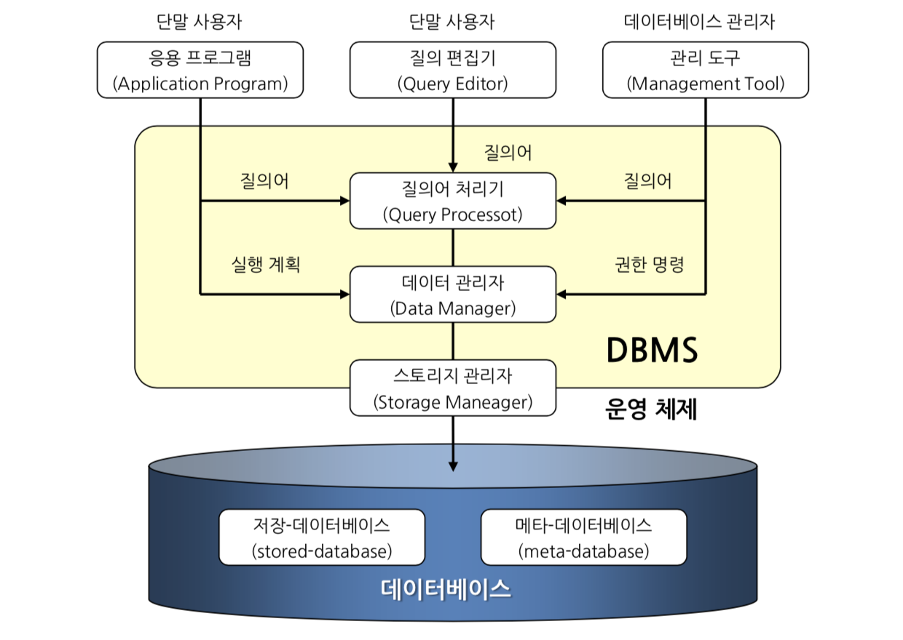

## 데이터베이스 정의

### 정보를 컴퓨터에 저장하는 방법

- 파일 시스템을 이용하는 방법
- 데이터베이스 시스템을 이용하는 방법

### 다수의 사용자가 사용하는 파일 시스템의 문제점

- 데이터가 중복 되며 데이터간 불일치성이 발생
- 파일 분석마다 별도의 프로그램 필요
- 무결성을 보장할 수 없다

### 데이터베이스

- 연관된 정보의 중복을 최소화하여 필요한 정보를 효과적으로 공유하도록 한 정보의 집합체
- 즉정 조직의 응용 업무에 공동 사용하기 위하여 모아놓은 운영 및 전략 수립에 필요한 영속성 데이터의 집합체
    - 운영 데이터
    - 의사결정 데이터
    - 통합 데이터
    - 공유 데이터

### 구성

데이터베이스, DBMS, 응용프로그램, 사용자 그룹

### SQK

- 저장 데이터

Structured Query Language

### 분야

- 유전자 정보, 지리 정보 등의 대용량 데이터
- 모바일 데이터베이스
- 빅 데이터
- NoSQL DBMS

### 정보 시스템 안에 데이터베이스를 포함하여 얻는 장점

- 문서화 된 파일과 종이문서를 유지, 보관할 필요가 없다
- 신속하게 검색하고 변경
- 업무 처리의 정확성 보장

### 데이터 독립성

- 논리적 데이터 독립성
    - 데이터베이스의 논리적인 구조가 변하더라도 응용 프로그램에는 아무런 영향을 미치지 않는 것
- 물리적 데이터 독립성
    - 데이터의 논리적 구조나 프로그램을 수정하지 않고도 시스템의 성능을 향상시키기 위해서 데이터의 물리적인 저장 형식과 그 구성의 변경이 허용되는 것

⇒ 독립성이 보장되었을 경우 

- 데이터베이스를 사용하는 응용프로그램들을 수정하지 않고도 데이터의 구성, 표기 방법, 저장 위치를 변경
- 데이터에 접근하는 응용 프로그램에 영향을 미치지 않고서도 데이터를 처리하는 하드웨나 소프트웨어를 보다 발전된 형태로 변경 또는 대체 가능

## 데이터베이스 시스템의 논리적 구조와 구성

### 데이터베이스 시스템의 단계별 구조

- 외부 단계 (외부 스키마): 특정 사용자 관점의 일부 데이터베이스를 논리적 구조로 기술
- 개념 단계 (개념 스키마): 관리자 관점의 전체 데이터베이스를 논리적 구조로 기술
- 내부 단계 (내부 스키마): 전체 데이터베이스의 물리적 저장 구조에 대해 기술된 단계

### 외부 단계 (external level)

- 외부 스키마 : 외부 단계에서 정의된 **논리적 구조**, **부스키마**(Sub Schema), **뷰**(View)

### 개념 단계 (conceptual level)

- 개념 스키마
    - 개념 단계에서 정의된 논리적 구조
    - 일반적인 스키마
    - 전체 데이터베이스에 대한 논리적 구조를 포함
    - 대상 개체에 대한 속성, 데이터 형식, 제약 조건, 사용자 연산 등과 개체들 간의 관계가 기술
    - 데이터의 저장 구조, 실제 위치, 접근 방법 등과 같은 물리적 명세는 포함되지 않음

### 내부 단계

- 내부 스키마
    - 저장 스키마 (storage schema)
    - 하위 단계를 표현하는 것으로 다양한 형태의 내부 레코드로 구성

### 인터페이스

- 응용 인터페이스 : 외부 단계와 개념 단계의 매핑
- 저장 인터페이스 : 개념 단계와 내부 단계의 매핑
- 장치 인터페이스 : 내부 단계와 저장 장치의 매핑

### 사용자 데이터베이스 vs 시스템 데이터베이스

- 사용자 데이터베이스 (저장 데이터베이스) : 조직의 운영 또는 의사 결정에 필
요한 정보를 운영할 목적으로 만들어진 데이터베이스
- 시스템 데이터베이스 (메타 데이터베이스) : 시스템 운영을 위해 시스템이 내
부적으로 필요로 하는 다양한 정보를 보관할 목적으로 만들어 데이터베이스
- 통상 데이터베이스라고 하면 이 두 개의 데이터베이스를 모두 포함한 의미로
사용된다.

## 데이터베이스 관리 시스템 (DBMS)

### 요구 처리 과정

1. 질의 작성 : 질의어(query language)를 사용하여 DB로부터 필요한 정보 요구
2. 질의 분석 : DBMS는 사용자가 전송한 요구 분석
3. 질의 최적화 : DBMS는 분석된 요구에 대한 최적화된 물리적 절차를 결정
4. 질의 수행 : DBMS는 물리적 절차에 따라 필요한 연산을 수행, 사용자에게 필요한 정보 제공

### 구성요소

- 저장-데이터베이스
- 메타-데이터베이스
- 앤드-유저, 데이터베이스 관리자(DBA)
    - 응용프로그램
    - 질의 편집기
    - 관리도구
- 질의어 처리기
- 데이터 관리자
- 스토리지 관리자

### 주요 기능

- 질의 처리
- 스토리지 관리자와의 상호 통신
- 무결성 유지
- 보안 유지
- 백업과 복구
- 동시성 제어

### 데이터 언어

- DBMS 에 대한 언어 형식의 사용자 인터페이스
- DBMS 에서는 통상 데이터 언어를 통해 사용자의 요구사항을 입력으로 받아 처리

### 언어의 분류

- 데이터 정의어 (*Data Definition Language; DDL*)
    - 사용자 데이터베이스 객체의 논리적 구조를 정의
    - DB, DB 객체에 대한 정의, 수정, 삭제 기능
    - 데이터 정의어로 정의된 데이터베이스 객체들은 질의 처리 과정을 거친 후 결과가 메타-데이터베이스에 저장된다
    - *메타-데이터베이스 ; 데이터 사전, 시스템 카탈로그
- 데이터 조작어 (*Data Manipulation Language; DML*)
    - 데이터베이스에 저장된 데이터를 조작하기 위한 일련의 연산을 제공하는 언어
    - 삽입 (insert)
    - 갱신 (update)
    - 검색 (select)
    - 삭제 (delete)
    - 질의어 (query language)
        - 데이터 조작어 중 데이터 검색을 요청하는 부분
        - 데이터베이스에 대한 요구를 질문의 형식으로 전달, 데이터베이스는 이에 응답한다는 의미
        - 통상 많은 경우에서 데이터 언어와 질의어란 용어를 혼용해서 사용하고 있다
        - 대화식 질의어 vs 내장형 질의어
- 데이터 제어어 (*Data Control Language; DCL*)
    - 데이터베이스에 저장된 데이터의 보안 및 권한을 제어하거나 일련의 질의에 대해 동시성 제어를 수행할 수 있도록 지원하는 언어
    - 데이터 정의어나 데이터 조작어에 속하지 않는 사용자 계정, 세션 관리, 로그인, 서버 관리 등 다양한 제어 기능을 담당

### 데이터베이스 사용자

- 응용 프로그래머 ; 개발자
- 데이터베이스 설계자
- 일반 사용자
- 데이터베이스 관리자 (Database Administrator; DBA)
    - 스키마 (schema)의 정의와 수정
    - 데이터 저장구조와 접근방법의 정의
    - 사용자에게 데이터 접근 권한을 부여
    - 무결정 제약조건(intergrity constrain)을 지정
    - 백업과 복구를 위한 정책 결정
    - 가용성 유지

## 데이터 모델의 개념

### 목적

실 세계 대상에서 요구되는 모든 데이터 객체를 정보 시스템에서 처리하기 용이하도록 완벽하고 정확하게 표현

### 장점

- 실 세계의 대상에 대한 이해를 쉽게 할 수 있다
- 특정 대상이나 관련성에 대한 부가적인 설명을 하지 않다도 된다
- 실 세계의 대상을 명확히 표현할 수 있다
- 다른 사람과 정보를 쉽게 공유할 수 있다
- 실 세계의 대상을 특정 시스템으로 정확히 사상할 수 있다

### 데이터 모델

데이터 모델을 사용하여 현실 세계를 표현하는 과정

### 데이터 모델의 개념

- 현실 세계 (살체) - 개념 세계 (정보) - 컴퓨터 세계 (데이터)
- 객체(object) - 개체(entity) - 레코드 타입(record type)

### 데이터베이스 설계에 사용되는 데이터 모델

- 개념적 데이터 모델
    - 현실세계 정보를 정보를 개념적 데이터 구조로 표현하는데 사용되는 데이터 모델
- 논리적 데이터 모델
    - 데이터베이스 모델
- 물리적 데이터 모델
    - 언어 인터페이스이며 설계 과정의 최종 단계

### 데이터 모델의 구성 요소

- 논리적으로 표현된 데이터 구조 (structure)
- 해당 구조에서 허용될 수 있는 연산 (operation)
- 해당 구조와 연산에서 유지되어야 할 제약조건 (constraints)

## 개념적 데이터 모델

### 개념적 데이터 모델링의 개념

- 실 세계의 대상을 추상적 개념인 개체와 관계로 식별하는 과정
- 데이터베이스 관리 시스템이나 컴퓨터 하드웨어와는 독립적으로 인간의 이해를 위해 실 세계의 대상을 표현하는 과정

### 개체 (entity)

- 공통된 성질을 갖는다
- 공통적으로 생각할 수 있는 개념이나 정보의 단위
- 개체는 세부적으로 장소, 사건 등과 같이 눈에 보이지 않는 것과 물건등과 같이 눈에 보이는 것으로 구분될 수 있으나 정의되는 형태는 동일 함
- 하나의 개체를 컴퓨터속의 파일이나 테이블에 대응
- 한 개체 내에서 구별되는 실 세계의 객체(instance)들은 테이블의 각 레코드(tuple)들로 매핑됨

### 개체의 속성 (Attribute)

- 복합 속성
- 단일치 속성
- 다중치 속성

### 관계 (relationship)

- 집합들의 구성 원소 사이에 대응성(correspondence), 즉 매핑을 의미
- 단일 관계 (unary relationship) : 한 개의 개체형 내에서 이루어진 관계
- 이진 관계 (binary relationship) : 두 대의 개체형들이 연관된 관계
- 삼진 관계 (ternary relationship) : 세 개의 개체형들이 연관된 관계

### 관계의 카디널리티 (cardinality)

- 관계에 참여하는 하나의 개체에 대해 다른 개체형에서 몇 개의 개체가 참여하는지를 형태로 나타내는 것

## 논리적 데이터 모델

### 개념

데이터베이스가 채택한 논리적 데이터 모델을 사용하여 논리적 데이터 구조로 표현하는 과정

### 종류

- 관계 데이터 모델
- 계층 데이터 모델
- 네트워크 데이터 모델
- 객체지향 데이터 모델
- 객체-관계 데이터 모델

### 관계 데이터 모델

- 특정한 대상을 표현할 때 데이터 항목을 나타내는 속성과 레코드 같은 개념을 갖는 튜플(row)들로 구성된 테이블로 표현한다
- 테이블 (Relational Data Model)
    - 2차원 형식을 갖는 표를 지칭
    - 개체 인스턴스들의 집합, 개체(entity)를 대표함
- 속성 (attribute)
    - 테이블의 열 (column)
- 튜플 (tuple)
    - 테이블의 행 (row)
    - 개체 인스턴스 (entity instance)
    - 레코드 (record)
- 도메인
    - 속성이 가질 수 있는 값들의 집합
- 관계

### 계층 데이터 모델 (Hierarchical Data Model)

- 가장 오래된 데이터베이스 표현 모델
- 데이터를 트리 구조의 형태로 조직화
- 데이터는 레코드의 집합 형태로 저장되며, 레코드는 다른 레코드와 연결 관계를 형성할 수 있는 ‘링크(link)’를 가질 수 있다

### 네트워크 데이터 모델

- 구별 가늘한 객체를 나타내는 개체는 레코드의 집합으로 표현하고, 개체 간의 관계를 나타내기 위해서 별도의 링크 구조를 사용
- 1:1, 1:N, N:M 관계를 모두 표현할 수 있다
- 그래프 형태로 모델링 한다

### 객체 지향 데이터 모델

- 상속성, 객체 식별자, 자료 추상형 등의 객체 지향 개념과 데이터베이스의 개념을 통합하여 관리 대상을 실 세계와 유사하게 모형화 하는 데이터 모델
- 복잡한 실 세계의 정보 시스템을 효율적으로 모델링하고 구현할 수 있다
- 멀티미디어의 보급과 함께 더욱 복잡해지는 정보 세계의 객체들을 통합 관리하는데 유리
- 비정형의 대용량 데이터를 처리하기에 적합
- 자료 추상형(ADT: Abstract Data Type), 객체 식별(Object Identiy), 상속성(Inheritance) 등과 같은 개념을 지원

### 객체-관계 데이터 모델

- 편리한 관계 데이터 모델 기반 위에 복잡한 모델링 능력을 갖는 객체 지향 데이터 모델을 통합한 데이터 모델
- 관계 데이터 모델에 객체 지향성과 추가 데이터 형을 다루기 위한 구조체를 포함시켜 확장 시킨 형태
- 모델링 능력은 확장시킨 반면, 데이터에 대한 선언적 액세스 같은 관계형 기본은 유지하여 기존의 관계형 언어와의 양립성을 향상시킴
- 개념적 데이터 모델에서 객체-관계를 나타내는 개체-관계 모델(ER 모델)과는 전혀 다른 논리적 데이터 모델이므로 용어 사용에 주의를 요구한다

### 데이터모델에 따른 상용 DBMS 제품의 종류

- 계층 데이터 모델
    - IMS (IBM)
    - System 2000 (Intel)
- 네트워크 데이터 모델
    - IDMS (Cullinet)
    - Total (Sperry)
    - Image (HP)
- 관계 데이터 모델
    - DB2 (IBM)
    - Oracle (Oracle)
    - SQL Server (Microsoft)
    - Altibase (Altibase)
    - MySQL (MySQL AB, 현 Oracle)
- 객체 지향 데이터 모델
    - Iris (HP)
    - Orion (MCC)
    - GemStone (Servio Logic)
    - ObjectStore (ObjectDesign, 현 eXcelon)
- 객체-관계 데이터 모델
    - UniSQL (UniSQL, 현 한국컴퓨터통신)
    - Informix Universal Server (Infomix, 현 IBM)

## 관계 데이터 모델

### 데이터 모델

개념적으로 단순하여 해당 모델에 대한 이해나 구현이 직관적이고 용이하다

### 용어

- 릴레이션 (relation) : 테이블 구조
- 튜플 (tuple) : 이름을 갖지 않는 행
- 속성 (attribute) : 이름을 갖지 않는 열
- 키 (key) : 릴레이션을 구성하는 퓨플의 속성들 중 튜플을 유일하게 식별할 수 있는 속성
- 기본 키 (primary key) : 키 속성 중 튜플을 식별하는 대표적 속성으로 사용자에 의해서 지정된 속성
- 도메인 (domain) : 각각의 속성들이 가질 수 있는 값의 집합

### 구조

### 릴레이션 특징 (테이블의 특징)

- 각 행 단위로 모든 속성들은 단일값을 가질 수 있다 (각 행의 각 컬럼은 단일 값을 가진다)
- 릴레이션 내에 중복된 튜플은 허용하지 않는다 (테이블 내에서 중복된 행은 허용하지 않는다)
- 튜플 간의 순서는 무의미하다 (행들 간의 순서는 무의미하다)
- 속성 산의 순서는 무의미하다 (컬럼들 간의 순서는 무의미하다)

### 스키마(schema)와 인스턴스(instance)

- 스키마 (schema) : 해당 객체의 논리적 구조 (논리적으로 지정된 속성들과 그 속성들이 가지게 될 값의 유형을 정의해 놓은 형태)
    - 릴레이션의 해딩에 해당함
- 인스턴스 (intance) : 해당 객체의 물리적 구조 (물리적으로 실제 값을 가지고 있는 형태)
    - 릴레이션의 바디에 해당함

### 키 (Key)

- 유일성 : 릴레이션의 서로 다른 튜플들이 같은 키 값을 갖지 않는다
- 최소성 : 유일성을 만족하기 위해 키가 최소의 속성으로만 구성되어야 한다
- 종류
    - 후보키
    - 기본키
    - 대체키
    - 슈퍼키
    - 외래키

### 데이터 모델의 연산

- 집합 연산 : 릴레이션의 튜플들을 집합의 원소로 취급
- 관계 연산 : 튜플들의 구조를 기반으로 처리

### 합집합 (union)

피연산자로 참여한 각각의 릴레이션의 튜플들을 모두 포함하되 중복되는 튜플들은 결과 릴레이션에서 한번만 나타남

### 교집합 (intersection)

중복되어 나타난 튜플로만 구성된 릴레이션 반환

### 차집합 (difference)

첫 번째 피연산자 릴레이션은 존재하지만 두번째 피연산자 릴레이션에는 존재하지 않는 튜플로만 구성된 릴레이션 반환

### 카티션 프로덕트 (cartesian product)

피연산자로 참여한 두 릴레이션의 모든 튜플들 간의 조합들에 대해 각 튜플들을 병합한 연산

### 프로젝트 (project)

지정된 속성 항목만으로 구성된 릴레이션을 반환

### 셀렉트 (select)

특정 조건에 맞는 튜플들의 집합을 구하는 연산

### 조인 (join)

상호 관련성을 구하기 위한 연산으로 두 릴레이션의 카티션 프로덕트 연산과 셀렉트 연산의 조합으로 구성된 연산

### 디비전 (division)

첫 번째 피연산자 릴레이션을 두 번째 피연산자 릴레이션으로 나누어 새로운 결과 릴레이션을 반환하는 연산

### 무결성 제약조건

### 무결성

데이터 및 네트워크 보안에 있어서 정보가 인가된 사람에 의해서만 접근이나 변경이 가능한 성질

### 데이터 무결성

데이터를 인가되지 않은 방법으로 변경할 수 없도록 보호하는 성질

### 물리적 무결성 제약조건

데이터 모델 내부에서 정의되고, 주로 데이터의 구조나 이에 적용되는 연산의 물리적 특성을 제약하는 조건

### 의미적 무결정 제약조건

데이터베이스 설계자가 외부 스키마를 정의할 때 해당 데이터베이스가 실 세계를 정확히 반영하도록 하기 위해서 데이터베이스 안에 의미에 관한 정보를 규정하도록 하는 제약조건

### 개체 무결정 제약조건 (entity intergrity constraint)

- 하나의 릴레이션에서 기본키로 지정된 모든 튜플들의 속성은 항상 널(null)값을 가질 수 없다
- 릴레이션의 모든 튜플들에 대한 유일성을 보장할 수 있다

### 참조 무결성 제약조건 (referential intergrity constraint)

- 릴레이션과 릴레이션 사이에 대해 참조의 일관성을 보장하기 위한 조건
- DBMS가 제공하는 옵션
    - 제한 (restricted)
        - 위반을 야기한 연산을 단순히 거절
    - 연쇄 (cascade)
        - 참조되는 릴레이션에서 튜플을 삭제하고, 참조하는 릴레이션에서 이 튜플들도 함께 삭제
    - 널값 (nullify)
        - 참조되는 릴레이션에서 튜플을 삭제하고, 참조하는 릴레이션에서 이 튜플값을 참조하는 튜플들의 외래 키에 null 값을 삽입
    - 기본값 (default)

### 도메인 무결정 제약조건 (domain intergrity constraint)

- 다른 릴레이션과 관계없이 속성 자체에만 적용되는 제약족건

### 사용자 정의 무결정 제약조건 (user define intergrity constraint)

- 사용자가 다른 무결성 범주에 포함되지 않는 특정 업무 규칙을 정의

# MS-SQL Server

## 데이터베이스 엔진 아키텍처

- 외부 프로토콜 : 서버 Network Protocol(TCP/IP, Named Pipe 등)을 의미
- 쿼리 프로세서 : 쿼리에 대한 파싱, 최적화 및 실행을 담당
- 스토리지 엔진 : 데이터에 대한 처리(트랜잭션, 잠금 등)를 담당
- SQL OS : SQL Server 내부의 OS와 같은 역할을 수행

## 물리적 데이터베이스 구조

- 페이지 : SQL Server의 기본 데이터 저장 단위이자 디스크 I/O의 단위, 8KB 고정
- 익스텐트 : 공간 관리의 기본 단위, 하나의 익스텐트는 연속하는 8페이지로 구성(64KB)
- 데이터베이스 파일 : 여러 개의 익스텐트들이 묶여서 파일 단위로 기록 (주 데이터 ~.mdf, 보조 데이터 ~.ndf, 로그 파일 ~.ldf)
- 파일 그룹
    - 할당 및 관리를 위해 파일 그룹을 통해 데이터베이스 개체와 파일을 함께 그룹화 할 수 있다
    - 로그 파일은 파일 그룹에 포함되지 않음
    - 주 파일 그룹은 주 데이터 파일 그룹에 특별히 할당되지 않은 기타 파일을 포함, 시스템 테이블의 모든 페이지는 주 파일 그룹에 할당
    - 한 파일이 두 개 이상의 그룹에 속할 수 없으며, 테이블, 인덱스 및 큰 개체 데이터를 특정 파일 그룹에 연결할 수 있다

# SQL 언어

## SQL (Structtured Query Language)

- 관계 데이터베잇흐를 정의, 조작, 제어할 수 있도록 고안된 언어
- 데이터베이스 관리 시스템에 대한 언어 기반의 인터페이스
- 비절차적(nonprocedural) 언어

## SQL 정의어

(DDL; Data Definition Language)

### 정의

    CREATE DATABASE 

### 삭제

    DROP DATABASE

### 테이블 정의

    CREATE TABLE

### 테이블 변경

    ALTER TABLE > sp_rename 

### 인덱스 정의

    CREATE INDEX

## SQL 데이터 조작어

(DML; Data Manipulation Language)

### 데이터 조작어 종류

- SELECT : 테이블로부터 조건에 만족하는 튜플을 검색
- INSERT : 테이블에 튜플을 삽입
- DELETE : 테이블로부터 조건에 만족하는 튜플 삭제
- UPDATE : 테이블로부터 조건에 만족하는 튜플의 속성 값 변경

# 메타-데이터베이스

## 정의

데이터베이스 관리 시스템으로 하여금 고유의 기능을 적절히 수행할 수 있도록 하기 위해 데이터베이스에 관한 정보를 모아놓은 시스템

## 용어

- system catalog
- system view
- system table
- data dictionary

## 관계 데이터베이스 관리 시스템에서의 메타-데이터베이스

- 데이터베이스, 테이블, 뷰, 인덱스, 저장 프로시저, 사용자 정의 함수, 제약 조건 등과 같이 다양한 데이터베이스 객체들에 관한 정보를 포함하고 관리하는 시스템 데이터베이스
- 관계 데이터베이스 관리 시스템에서는 메타-데이터베이스의 정보를 모두 테이블 형식으로 저장하고 관리한다
- SQL 언어를 사용하여 메타-데이터베이스에 있는 정보를 검색할 수 있다

## SQL Server의 메타-데이터베이스

- System view 라고 부름
- 시스템 정보를 저장하는 테이블들이 물리적으로 저장된 테이블이라기 보다는 사용자에게 필요한 만큼만 요청에 의해 동적으로 생성해서 보여주는 뷰의 처리 기법과 유사하기 때문에 붙여진 이름
- 시스템 정보를 담당하는 마스터 데이터베이스가 가지고 있는 시스템 뷰의 수는 SQL Server 2014의 경우 425개 (SQL Server 2008R2의 경우 354개)
- 사용자가 정의하는 데이터베이스는 기본적으로 모델 데이터베이스의 시스템 뷰로부터 그 구조를 상속받기 때문에 모델 데이터베이스와 동일한 수의 시스템 뷰를 갖는다
- SQL Server 주요 시스템 뷰
    - sys.databases: 정의된 데이터베이스에 관한 정보를 포함
    - sys.objects: 데이터베이스 내에 정의된 모든 객체에 관한 정보를 포함
    - sys.columns: 데이터베이스 내에 정의된 모든 속성에 관한 정보를 포함
    - sys.indexes: 데이터베이스 내에 정의된 모든 인덱스에 관한 정보를 포함

## 시스템 뷰 구성

### sys.databases

- 해당 SQL 서버 내에 정의된 모든 데이터베이스에 대해 하나의 튜플을 갖는다
- 각각의 데이터베이스에 대해 이름, 식별번호, 생성일 등 데이터베이스에 관한 여러 시스템 정보를 갖는다

### sys.tables

- 해당 데이터베이스 내에 정의된 모든 테이블에 대한 정보를 튜플의 정보를 갖는다
- 각 테이블에 대해 이름, 식별번호, 생성일, 구조 변경일 등 테이블에 관한 여러 시스템 정보를 갖는다

### sys.columns

- 해당 데이터베이스 내에 정의된 모든 속성들의 정보를 튜플의 정보로 갖는다
- 각 속성에 대해 이름, 속성을 포함하는 부모 객체의 식별 번호, 속성의 식별 번호, 사용자가 지정한 데이터 형의 식별번호 등 속성에 관한 여러 시스템 정보를 갖는다

### sys.indexes

- 해당 데이터베이스 내에 정의된 모든 인덱스들의 정보를 튜플이 갖는다
- 각 인덱스에 대해 이름, 인덱스를 갖는 부모 객체의 식별 번호, 인덱스의 식별 번호 등 인덱스의 관한 여러 시스템 정보를 갖는다

# 뷰

## 개념

- SELECT 문의 결과 집합으로 구성된 가상 테이블
- 뷰의 데이터는 실제 테이블 처럼 데이터가 저장되어 있는 것이 아니라 뷰를 SELECT 할 때 뷰에서 참고하고 있는 실제 테이블로부터 열과 행을 가져온다

## 장점

- 사용자가 보기를 원하는 자료를 쉽게 보여줌
- 권한과 관련되어 접근할 수 있는 자료를 제한
- 데이터를 다룰 때의 복잡성 해소
- 하위 호환성